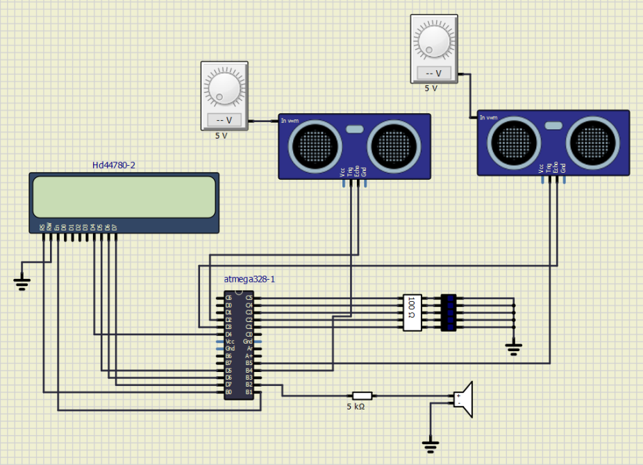

# Project_DE2

### Členové týmu

Michal Jemelka

Ondřej Pišťák 

[Odkaz na repositář v GitHubu](https://github.com/xjemel06/Digital-Electronics-2/tree/master/Project_DE2)

### Cíle projektu
- Cílem projektu je vytvořit funkční aplikaci parkovacího asistenta s využitím ultrazvukových senzorů a Arduina. Tato aplikace využívá periferie k zobrazování vzdálenosti objektu od senzoru. Pužité periferie jsou: LCD displej, LED panel a reproduktor. Následně je využit i komunikační protokol UART. Veškeré vzdálenosti jsou zobrazovány v centimetrech.

## Popis Hardwaru
- Schéma zapojení

- Jak si můžete všimnout v zapojení se nachází dva ultrazvukové senzory HC-SR04 připojené k mikroprocesoru ATmega328P. Dále se zde nachází LCD displej, který je připojený ve čtyř-bitovém módu a zobrazuje vzdálenost snímanou oběma senzory. Dále je k mikroprocesoru přes rezistory připojen LED panel s pěti LED, které začnou signalizovat pokud je překročena zadaná hranice vzdálenosti. Společně s LED panelem se aktivuje i reproduktor měnící kmitočet tónu v závislosti na vzálenosti.

## Popis kódu a simulace
- Stavový diagram
\

- Hlavní program [main.c](https://github.com/xjemel06/Digital-Electronics-2/blob/master/Project_DE2/Project_DE2/Project_DE2/Project_DE2/main.c) se dělí na import knihoven, hlavní smyčku a na obslužné funkce přerušení.\
\ 
### Import knihoven
- se propojí knihovny
-nadefinují globální proměnné a kmitočet procesoru\
\ 
### Hlavní smyčka
- inicializuje porty, komunikační protokol UART, LCD displej
- nastavení časovačů, a požadavek o přerušení
- nekonečný cyklus zaručující stálou funkčnost programu\
\
- Funkce přerušení - obsahuje čtyři funkce přerušení - dva typu PinChange a dva typu Timer\
\
### Přerušení založené na PinChange reagují na vzestupnou hranu na dvou EchoPinech
- PinChange0 reprezentuje levý senzor a PinChange1 pravý senzor.
- PinChange0 a PinChange1 mají prakticky stejnou funkci. V obou případech se měří šířka přijatého pulzu, která se dále přepočítává na reálnou vzdálenost v cm. Dále se veškerá potřebná data odesílají na LCD diplej a UART.
\
Přerušení založené na typu Timer používaji  časovače Timer1 a Timer2
- Požadavek přerušení od Timer1 vyvolá funkci, která vyšle na oba senzory 10 us pulzy, které vygenerují burst. Tato funkce se opakuje jednou za 1 s.
- Požadavek přerušení od Timer2 vyhodnocuje vzdálenost a podle toho spuští LED panel a zvukovou signalizaci.
\

## Video/Animation

Write your text here.

## References

1. Write your text here.
