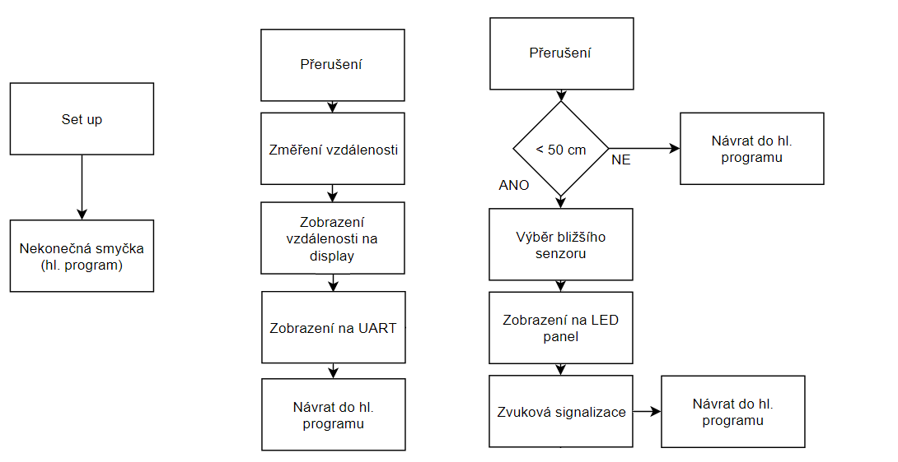

# Project_DE2

### Členové týmu

Michal Jemelka

Ondřej Pišťák 

[Odkaz na repositář v GitHubu](https://github.com/xjemel06/Digital-Electronics-2/tree/master/Project_DE2)

### Cíle projektu
- Cílem projektu je vytvořit funkční aplikaci parkovacího asistenta s využitím ultrazvukových senzorů a Arduina. Tato aplikace využívá periferie k zobrazování vzdálenosti objektu od senzoru. Pužité periferie jsou: LCD displej, LED panel a reproduktor. Následně je využit i komunikační protokol UART. Veškeré vzdálenosti jsou zobrazovány v centimetrech.

## Popis Hardwaru
- Schéma zapojení

- Jak si můžete všimnout v zapojení se nachází dva ultrazvukové senzory HC-SR04 připojené k mikroprocesoru ATmega328P. Dále se zde nachází LCD displej, který je připojený ve čtyř-bitovém módu a zobrazuje vzdálenost snímanou oběma senzory. Dále je k mikroprocesoru přes rezistory připojen LED panel s pěti LED, které začnou signalizovat pokud je překročena zadaná hranice vzdálenosti. Společně s LED panelem se aktivuje i reproduktor měnící kmitočet tónu v závislosti na vzálenosti.

## Popis kódu a simulace
- Stavový diagram

## Video/Animation

Write your text here.

## References

1. Write your text here.
